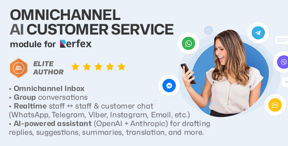

# 👋 OmniChannel AI Customer Service for Perfex CRM

<figure><figcaption></figcaption></figure>

PulseChat is a full‑featured chat and omnichannel inbox module for **Perfex CRM**. It brings Slack/Teams‑style messaging into your CRM, with:

* **Real‑time staff ↔ staff chat**
* **Staff ↔ client messaging** (via the client portal)
* **Group conversations**
* **Omnichannel inbox** for WhatsApp, Telegram, Email, etc.
* **AI‑powered assistant** (OpenAI + Anthropic) for drafting replies, suggestions, summaries, translation, and more.

This GitBook is the main documentation for the module. It explains:

* What PulseChat does and where it lives inside Perfex
* How to install and upgrade it
* How admins configure transport, channels, AI, permissions, and limits
* How staff actually use the chat UI day‑to‑day
* How the omnichannel and AI layers work under the hood

If you’re new to PulseChat, start with [**🚀 Getting Started**](getting-started.md). If you’re integrating or debugging, see [**🧱 Architecture & Internals**](architecture.md) and [**🧪 Troubleshooting & FAQ**](troubleshooting.md).
